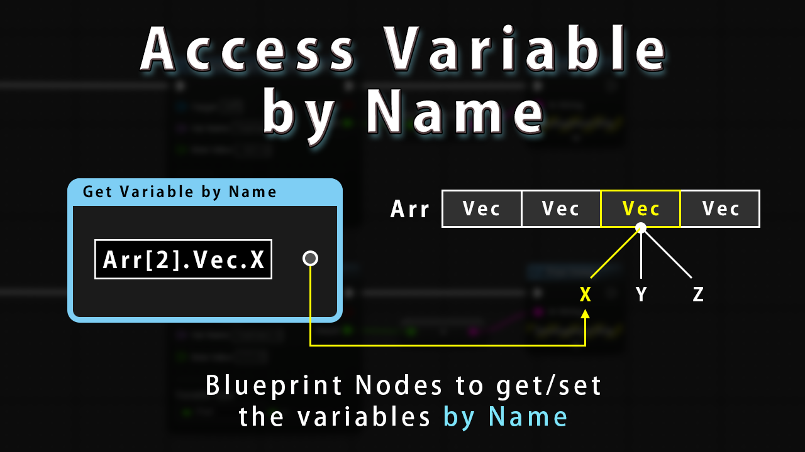
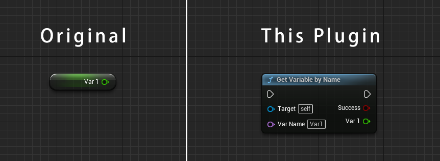
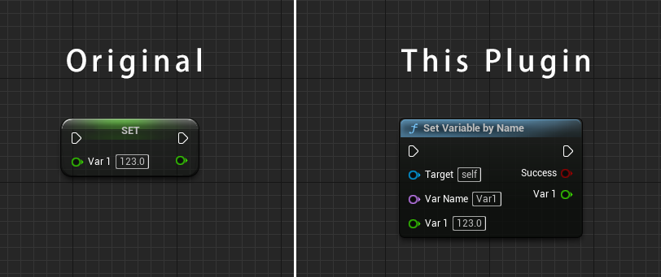

# Unreal Engine Plugin: Access Variable by Name

**Access Variable by Name** is an Unreal Engine plugin which adds Blueprint nodes to get/set the variable by name.
These nodes enable you to get/set the variable by the string instead of the get/set node.

Generally, you need to place a get/set node when you try to get/set the variable on the vanilla Unreal Engine.  
This workflow works greatly in many cases, but there are problems in some cases.

For example:

* When you access to the deep nested variable, you need to place lots of `Get`/`Set` and related nodes.
  * Ex: To access the member variable `X` of `Vector`, you need to place `Get Vector` node and `Break Vector` node.
* When you set a new value to many variables at once, you need to place the sequence of `Set` nodes.
  * Ex: To set a new value to the member variable `A`, `B` and `C`, you need to place `Set A` node, `Set B` node and `Set C` node,

By using this plugin, these problems will be solved gracefully.

## Features

This plugin adds below Blueprint nodes.

### Get/Set Variable by Name

* Get/Set a variable by specifying name and target object.
* These nodes will analyze the name and target (static analysis), and change the node's pin type to the same variable type automatically.
  * This ensures that the variable name and pin type is valid.
* The name pin supports [a custom syntax](docs/tutorial.md#custom-syntax) to access a deep nested variable.

### Get/Set Variable by Name (Dynamic)

* Get/Set a variable by specifying name and target object.
* These nodes accepts the name which can be changed dynamically at runtime.
  * This feature is useful when you get/set many variables at once.
* The name pin supports [a custom syntax](docs/tutorial.md#custom-syntax) to access a deep nested variable.

## Supported Environment

This plugin supports on the below environment.

* Unreal Engine Version: 4.26 / 4.27 / 5.0
* Development Platforms: Windows / macOS / Linux
* Target Build Platforms: All platforms

## Installation

This plugin is distributed at [the Marketplace]().  
You can buy and install from there.

> TODO: Add link to the Marketplace

Free trial version is also available.  
See [the installation document](docs/installation.md) if you want to install a free trial version.  
Free trial version does not support below features.

* A Variable whose type is Struct/Enum/Array/Set/Map.
* [A custom syntax](docs/tutorial.md#custom-syntax) to access the nested variable.

To get the benefit fully from this plugin, consider to buy this plugin at [the Marketplace]().

> TODO: Add link to the Marketplace

## Tutorial

See [the tutorial document](docs/tutorial.md).

## Change Log

See [CHANGELOG.md](CHANGELOG.md).

## Bug Report / Feature Request / Disscussions

If you want to report problems or request features, please [make issues](https://github.com/colory-games/UEPlugin-AccessVariableByName/issues).  
You can also discuss about this plugin at [Discord](https://discord.gg/Tg9A5JxR).

## Project Author

### Owner

This project is owned by the members of [Colory Games](https://colory-games.net/).  
The maintainer of this project is as follows.

|Name|Contact|
|---|---|
|[**@nutti**](https://github.com/nutti)|[Website (Japanese Only)](https://colorful-pico.net/) \| [Twitter](https://twitter.com/nutti__)|
