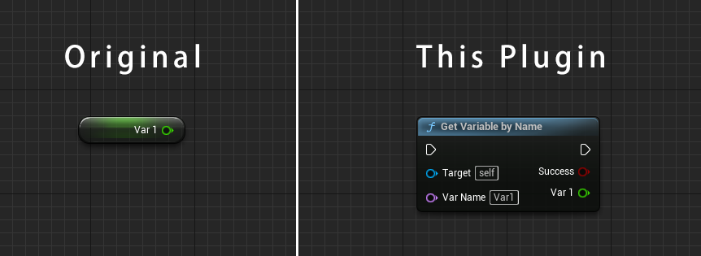
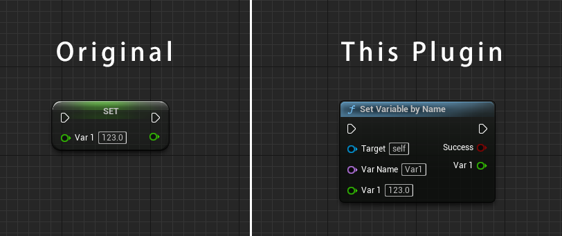
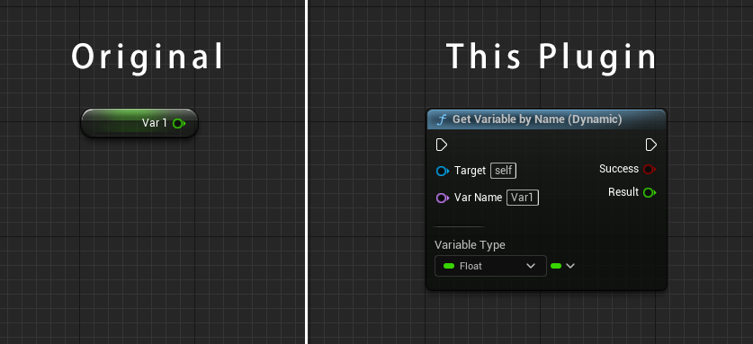
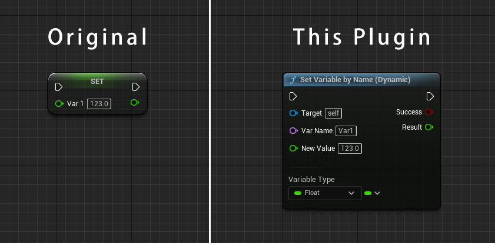

# Tutorial

## Introduction Video

> TODO: Add Video link

## Get Variables by Name

'Get Variables by Name' node gets variables by specifing the name and the target object.  
This node analyzes the name and the target (static analysis), and changes the type of output pins to the same variable type automatically.  
It is useful to check if the pin type is valid on the compilation time.



### Usage

1. Search and place 'Get Variables by Name' node on the Blueprint editor.
2. Connect node's pins to the other pins or input a literal string.

|Pin Name|Input/Output|Description|
|---|---|---|
|Target|Input|An object reference which may have a desired member variables.|
|Var Name|Input|The name of a desired variable.<br>This pin's value support [a custom syntax](#custom-syntax) to access the nested variable.<br>Only literal string is allowed, and error if you connect pin to the other node. Use [Get Variables by Name (Dynamic)]() node instead.|
|Success|Output|Output `True` if a desired member variable is successfully acquired.|
|(Output variable name)|Output|Output the value of a desired member variable.<br>The pin name will be same as a name of a desired member variable.<br>This pin will be hidden if a desired member variable does not exist.|

## Set Variables by Name

'Set Variables by Name' node sets a new value to variables by specifing the name and the target object.  
This node analyzes the name and the target (static analysis), and changes the type of new value pins and output pins to the same variable type automatically.  



### Usage

1. Search and place 'Set Variables by Name' node on the Blueprint editor.
2. Connect node's pins to the other pins or input a literal string.

|Pin Name|Input/Output|Description|
|---|---|---|
|Target|Input|An object reference which may have a desired member variables.|
|Var Name|Input|The name of a desired variable.<br>This pin's value support [a custom syntax](#custom-syntax) to access the nested variable.<br>Only literal string is allowed, and error if you connect pin to the other node.|
|(Input variable name)|Input|A new value to be set to a desired member variable.<br>The pin name will be same as a name of a desired member variable.<br>This pin will be hidden if a desired member variable does not exist.|
|Success|Output|Output `True` if a desired member variable is successfully acquired.<br>An output will be an value after a new value set.|
|(Output variable name)|Output|Output the value of a desired member variable.<br>The pin name will be same as a name of a desired member variable.<br>This pin will be hidden if a desired member variable does not exist.|

## Get Variables by Name (Dynamic)

'Get Variables by Name (Dynamic)' node gets variables by specifing the name and the target object.  
The concept of this node is same as [Get Variable by Name](#get-variables-by-name) node.  
But this node accepts [the name which can be changed dynamically at runtime](#dynamically-changeable-name).



### Usage

1. Search and place 'Get Variables by Name (Dynamic)' node on the Blueprint editor.
2. Select 'Variable Type' which is a desired type same as the type of a desired member variables.
3. Connect node's pins to the other pins or input a literal string.

|Pin Name|Input/Output|Description|
|---|---|---|
|Target|Input|An object reference which may have a desired member variables.|
|Var Name|Input|The name of a desired variable.<br>This pin's value support [a custom syntax](#custom-syntax) to access the nested variable.|
|Success|Output|Output `True` if a desired member variable is successfully acquired.<br>Output `False` if types are mismatched between 'Variable Type' and actual one.|
|Result|Output|Output the value of a desired member variable.|

## Set Variables by Name (Dynamic)

'Set Variables by Name (Dynamic)' node gets variables by specifing the name and the target object.  
The concept of this node is same as [Set Variable by Name](#get-variables-by-name) node.  
But this node accepts [the name which can be changed dynamically at runtime](#dynamically-changeable-name).



### Usage

1. Search and place 'Set Variables by Name (Dynamic)' node on the Blueprint editor.
2. Select 'Variable Type' which is a desired type same as the type of a desired member variables.
3. Connect node's pins to the other pins or input a literal string.

|Pin Name|Input/Output|Description|
|---|---|---|
|Target|Input|An object reference which may have a desired member variables.|
|Var Name|Input|The name of a desired variable.<br>This pin's value support [a custom syntax](#custom-syntax) to access the nested variable.|
|New Value|Input|A new value to be set to a desired member variable.|
|Success|Output|Output `True` if a desired member variable is successfully acquired.<br>Output `False` if types are mismatched between 'Variable Type' and actual one.|
|Result|Output|Output the value of a desired member variable.|

## Custom Syntax

'Var Name' pin of the node support a custom syntax to get/set a deep nested variable.

### Access to a structure/object member variable

You can access to structure/object member variable directly by specifing the dot separated name.  
In the case you want to access the member variable `X` which belongs to the `StructVar` with type of structure `Vector`, specify below literal string.

```
StructVar.X
```

#### Compare to the Blueprint script

Compared to the Blueprint script on the vanila Unreal Engine, you can get the desired variable more directly.  
If the variable is deeper, this syntax will be much more powerful.


### Access to an array/map element

You can access to the element of array/map by specifing the index or key.  
In the case you want to access the 2nd element of the array member variable `ArrayVar`, specify the index `1` surrounded by `[]`.

```
ArrayVar[2]
```


Note: Array index is 0-based index. If the specified index is out of range, 'Success' pin will output `False` value.

#### Compare to the Blueprint script

In the case you want to access the element of the set member variable `SetVar` whose key is `"Key"`, specify the key `"Key"` surrounded by `[]`.

```
SetVar["Key"]
```


Note: If the element is not found, 'Success' pin will output `False` value.

### Combined syntax

Of course, you can combine these syntax as follows.


## Dynamically changeable name

Dynamic version accepts the name which can be changed dynamically at runtime.  
It is useful to feed the name generated on the runtime.

In the case you want to set a new value to many variables at once, dynamic version is useful to realize this.


