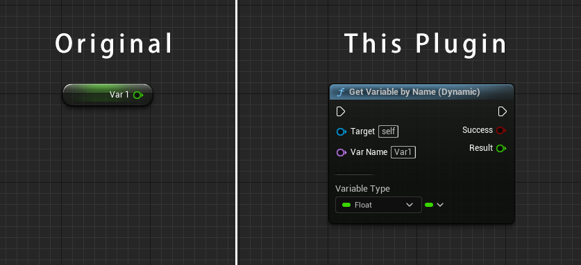
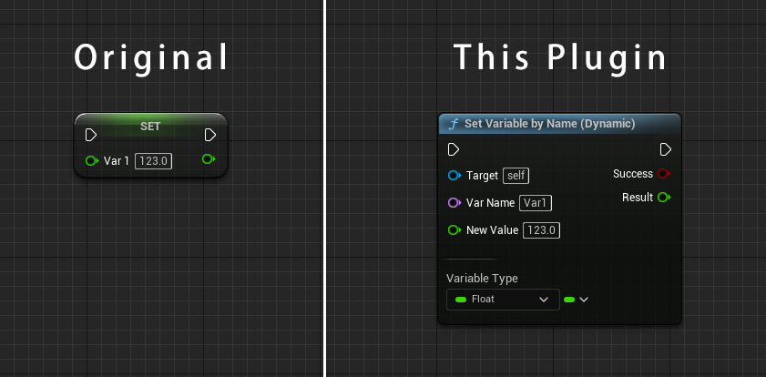
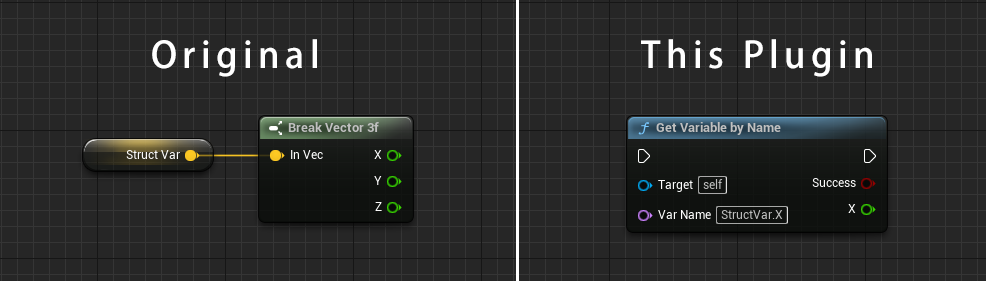
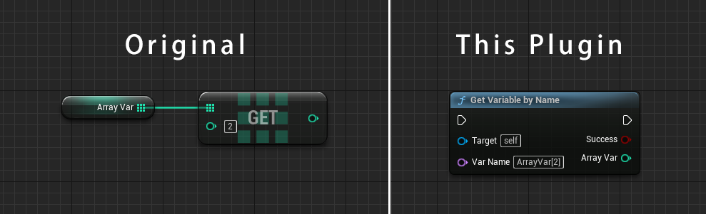
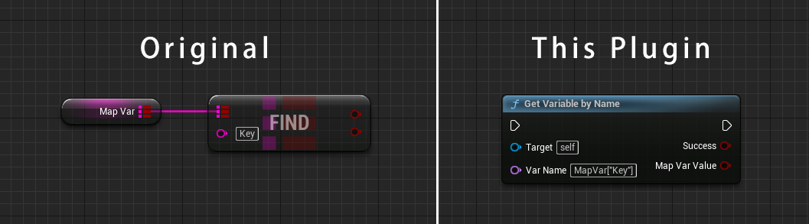
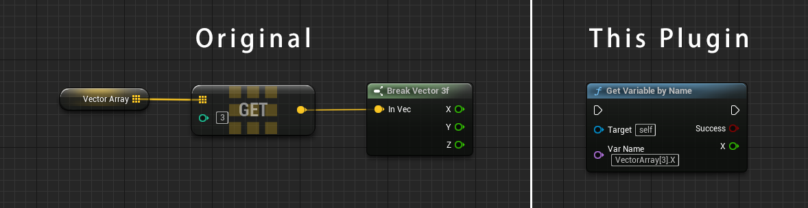
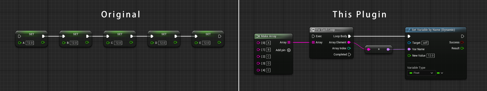

# Tutorial

## Introduction Video

[](https://www.youtube.com/watch?v=zUzJBnCgB1k)

## Get Variable by Name

'Get Variable by Name' node gets a variable by specifing the name and the target object.  
This node analyzes the name and the target (static analysis), and changes the type of output pin to the same variable type automatically.  
It is useful to check if the variable name and pin type is valid on the compilation time.


### Usage

1. Search and place 'Get Variable by Name' node on the Blueprint editor.
2. Connect node's pins to the other pins or input a literal string.

|Pin Name|Input/Output|Description|
|---|---|---|
|Target|Input|An object reference which may have a desired member variable.|
|Var Name|Input|The name of a desired variable.<br>This pin's value support [a custom syntax](#custom-syntax) to access the nested variable.<br>Only literal string is allowed, and error if you connect the pin to another node.<br>Use [Get Variable by Name (Dynamic)]() node instead.|
|Success|Output|Output `True` if a desired member variable is successfully acquired.|
|(Output variable name)|Output|Output the value of a desired member variable.<br>The pin name will be same as a name of a desired member variable.<br>This pin will be hidden if a desired member variable does not exist.|

### Additional Information

'Get Variable by Name' node have following properties.

|Category|Property Name|Description|
|---|---|---|
|Node Options|Pure Node|Make node a pure node if true.|
|Access Variable Options|Include Generation Class|Include variables from a generation class (UBlueprint) if true.|

## Set Variable by Name

'Set Variable by Name' node sets a new value to a variable by specifing the name and the target object.  
This node analyzes the name and the target (static analysis), and changes the type of new value pins and output pins to the same variable type automatically.  


### Usage

1. Search and place 'Set Variable by Name' node on the Blueprint editor.
2. Connect node's pins to the other pins or input a literal string.

|Pin Name|Input/Output|Description|
|---|---|---|
|Target|Input|An object reference which may have a desired member variable.|
|Var Name|Input|The name of a desired variable.<br>This pin's value support [a custom syntax](#custom-syntax) to access the nested variable.<br>Only literal string is allowed, and error if you connect pin to another node.|
|(Input variable name)|Input|A new value to be set to a desired member variable.<br>The pin name will be same as a name of a desired member variable.<br>This pin will be hidden if a desired member variable does not exist.|
|Success|Output|Output `True` if a desired member variable is successfully acquired.<br>An output will be an value after a new value set.|
|(Output variable name)|Output|Output the value of a desired member variable.<br>The pin name will be same as a name of a desired member variable.<br>This pin will be hidden if a desired member variable does not exist.|

### Additional Information

'Set Variable by Name' node have following properties.

|Category|Property Name|Description|
|---|---|---|
|Access Variable Options|Include Generation Class|Include variables from a generation class (UBlueprint) if true.|
|Container Type Access Options|Extend If Not Present|Create elements automatically if true when the element does not present.|

## Get Variable by Name (Dynamic)

'Get Variable by Name (Dynamic)' node gets a variable by specifing the name and the target object.  
The concept of this node is same as [Get Variable by Name](#get-variable-by-name) node.  
But this node accepts [the name which can be changed dynamically at runtime](#dynamically-changeable-name).



### Usage

1. Search and place 'Get Variable by Name (Dynamic)' node on the Blueprint editor.
2. Select 'Variable Type' which is a desired type same as the type of a desired member variable.
3. Connect node's pins to the other pins or input a literal string.

|Pin Name|Input/Output|Description|
|---|---|---|
|Target|Input|An object reference which may have a desired member variable.|
|Var Name|Input|The name of a desired variable.<br>This pin's value support [a custom syntax](#custom-syntax) to access the nested variable.|
|Success|Output|Output `True` if a desired member variable is successfully acquired.<br>Output `False` if types are mismatched between 'Variable Type' and actual one.|
|Result|Output|Output the value of a desired member variable.|

### Additional Information

'Get Variable by Name (Dynamic)' node have following properties.

|Category|Property Name|Description|
|---|---|---|
|Node Options|Pure Node|Make node a pure node if true.|
|Access Variable Options|Single Precision|PAccess float variable as a single precision float variable.|
|Access Variable Options|Include Generation Class|Include variables from a generation class (UBlueprint) if true.|

## Set Variable by Name (Dynamic)

'Set Variable by Name (Dynamic)' node gets a variable by specifing the name and the target object.  
The concept of this node is same as [Set Variable by Name](#get-variable-by-name) node.  
But this node accepts [the name which can be changed dynamically at runtime](#dynamically-changeable-name).



### Usage

1. Search and place 'Set Variable by Name (Dynamic)' node on the Blueprint editor.
2. Select 'Variable Type' which is a desired type same as the type of a desired member variable.
3. Connect node's pins to the other pins or input a literal string.

|Pin Name|Input/Output|Description|
|---|---|---|
|Target|Input|An object reference which may have a desired member variable.|
|Var Name|Input|The name of a desired variable.<br>This pin's value support [a custom syntax](#custom-syntax) to access the nested variable.|
|New Value|Input|A new value to be set to a desired member variable.|
|Success|Output|Output `True` if a desired member variable is successfully acquired.<br>Output `False` if types are mismatched between 'Variable Type' and actual one.|
|Result|Output|Output the value of a desired member variable.|

### Additional Information

'Set Variable by Name (Dynamic)' node have following properties.

|Category|Property Name|Description|
|---|---|---|
|Access Variable Options|Include Generation Class|Include variables from a generation class (UBlueprint) if true.|
|Access Variable Options|Single Precision|PAccess float variable as a single precision float variable.|
|Container Type Access Options|Extend If Not Present|Create elements automatically if true when the element does not present.|

## Custom Syntax

'Var Name' pin of the node support a custom syntax to get/set a deep nested variable.

### Access to a structure/object member variable

You can access to structure/object member variable directly by specifing the dot separated name.  
In the case you want to access the member variable `X` which belongs to the `StructVar` with type of structure `Vector`, specify below literal string.

```
StructVar.X
```

#### Compare to the Blueprint script

Compared to the Blueprint script on the vanila Unreal Engine, you can get the desired variable more directly.  
If the variable is deeper, this syntax will be much more powerful.



### Access to an array/map element

You can access to the element of array/map by specifing the index or key.  
In the case you want to access the 3rd element of the array member variable `ArrayVar`, specify the index `2` surrounded by `[]`.

```
ArrayVar[2]
```

In the case you want to access the element of the set member variable `SetVar` whose key is `"Key"`, specify the key `"Key"` surrounded by `[]`.

```
SetVar["Key"]
```

Note: Array index is 0-based index. If the specified index is out of range, 'Success' pin will output `False` value.

Note: If the element is not found, 'Success' pin will output `False` value.

#### Compare to the Blueprint script





### Combined syntax

Of course, you can combine these syntax as follows.



## Dynamically changeable name

Dynamic version accepts the name which can be changed dynamically at runtime.  
It is useful to feed the name generated on the runtime.

In the case you want to set a new value to many variables at once, dynamic version is useful to realize this.


